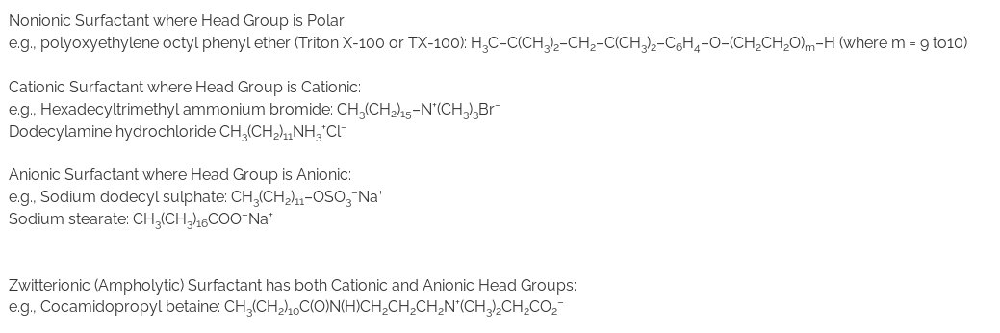

Soaps and detergents are known as >**surf**ace-**act**ive agents (also in short as **surfactants**). They have also been called as amphiphiles, tensides or paraffin-chain salts. Detergents e.g., sodium dodecyl sulfate or sodium lauryl sulfate (SDS or SLS: CH3(CH2)11OSO3–Na+ cetyltrimethylammonium bromide (CTAB: CH<subb>3(CH2)14CH2N+(CH3</sub)3Br+ ), Triton-X 100, etc. are synthetically prepared amphiphiles or surfactants. Soaps are salts of long-chain fatty acids, as for example, sodium salt of stearic acid: C17H35COO–Na+. Fatty acids with 18 or more carbon chains form insoluble soap and less than 10 carbon chain fatty acids are also not used in soaps because of their unpleasant odours and skin irritation properties.  

Surfactant molecules have two parts: a nonpolar part, made of chains of carbon atoms (usually 8 – 18 in number), called tail and a polar or ionic part, called head group. Therefore, the nonpolar tail part of such molecules has an affinity for nonpolar media whereas the polar or ionic part has an affinity for polar media. In other words, the surfactant molecules have a solvent loving and a solvent hating part whether the solvent is a polar or nonpolar one. These molecules are therefore known as amphiphilic or amphipathic molecules. If the solvent is polar water, the hydrophobic tails are water repelling whereas the head group is hydrophilic or water loving in nature. There can be a number of structurally different amphiphilic molecules depending on the length of the hydrophobic tail and the nature of the head group and its position along the backbone. The polar head group may be nonionic, cationic, anionic or zwitterionic. A few examples of such molecules are as follow:   

  
  

When dissolved in a polar solvent like water, surfactant molecules accumulate at the surface (interface) of the two fluids and modify the properties of the surface (for example, reduce the surface tension of water). These molecules are therefore known as **surf**ace-**act**ive **a**ge**nts** (also briefly as **surfactants**). Surfactants find many applications in our day-to-day life to the industry. For example, sodium lauryl sulphate is a synthetic anionic detergent used in toothpastes, shampoos, and laundry soaps. Many cationic and non-ionic detergents are used in hair conditioners and ‘no tear shampoo’. Many cationic detergents have germicidal properties and are used in hospital disinfectants, mouthwashes and certain eye-wetting solutions. High concentration surfactant solutions are used as drug carriers and micro-reactors for chemical synthesis and in froth flotation, petroleum recovery, etc.   

